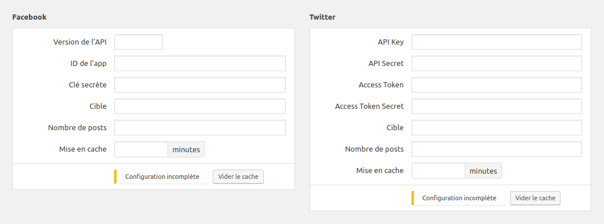

# Social Network Connection Field for ACF / WordPress

ACF/WordPress plugin to support publication retrieval from social networks.

I’m publishing this here because it might be useful to others,
but USE OF THIS SCRIPT IS ENTIRELY AT YOUR OWN RISK. I accept no liability from its use.

This WordPress *mu-plugin* adds an ACF field type which asks for connection parameters
for chosen network, connect, authenticate, and retrieve last publications.

**This plugin is aimed at website developers and doesn’t provide any front-end rendering.**

As I’m using this on lots of my clients websites, I’m really willing to improve its security,
reliability and its features. Contact me if you need support, I’d be pleased
to help and get feedback.

Supported networks :

* Facebook
* Instagram
* LinkedIn
* Pinterest
* Twitter
* Youtube

Each field asks for connection information needed to retrieve the posts,
for example the Facebook field asks for:

* API version
* App ID
* App Secret
* Target

A call to `get_field` returns an associative array of the retrieved last posts,
with each item containing following keys:

* `network`: Network name, *facebook*, *twitter*, etc.
* `url`: URL of the post on the social network
* `date`: Publication date of the post (`DateTime` object)
* `thumb`: Array with following keys:
    * `src`: Thumbnail URL
    * `width`: Width of the thumbnail
    * `height`: Height of the thumbnail
    * `srcset`: Alternative URLs when available
* `caption`: Associated text of the post

Example of displayed fields:



## Installation

### Composer

In your `composer.json`, add the repository:

```json
{
    "repositories": [
        { "type": "vcs", "url": "https://github.com/jerome-rdlv/social-network" }
    ]
}
```
then:

```
 composer require social-network:dev-master
```

### Manual

Drop the plugin folder in your `wp-content/mu-plugins/` directory, and
require it from another mu-plugin like `wp-content/mu-plugins/index.php`:

```php
require_once __DIR__ .'/social-network/social-network.php`;
```

This plugin has dependencies so if you chose manual installation you must
run `composer install` in plugin folder.

## Configuration

Configuration needed for each social network.

### Facebook

1. Create an App on [developer.facebook.com](https://developers.facebook.com/), the
account you use doesn’t matter BUT the owner account of the target page must appear
in App Roles / Roles screen as Administrators, Developers or Testers (I recommand this last one
if the App account is not the owner account of the target page).
2. Set website domain in App Settings (*App Domains* field)
3. Click *+ Add Platform* / *Website* and set *Site URL*
4. Click *+ App Product* / *Facebook Login*
5. In Facebook Login *Settings* set *Valid OAuth redirect URIs*
 (`https://xxxxx.xxx/wp-admin/` URL of the website)
6. On App *Dashboard*, get *App ID* and *App Secret* and fill the corresponding inputs
of your *Social Network* field

Authentication step (when using the connect button) must be done with the owner account
of the target page, otherwise it wont work.

Facebook App should stay in development status.

### Instagram

Only target is needed, it is the identifier that appears at the end of the Instagram URL:  
https://www.instagram.com/**xxxxxxx**

### Pinterest

Target is the complete URL of the target page.

### Twitter

1. Create an App on [apps.twitter.com](https://apps.twitter.com/app/new), the
account you use doesn’t matter
2. Set *Callback URL* (`/wp-admin/` URL of the website)
3. In *Keys and Access Tokens* tab, get *API Key* and *API Secret* and fill
the corresponding inputs of your *Social Network* field

### YouTube


## Todo

* Improve this doc with installation and configuration information
* Internationalization
* Add support for Google+

## Compatibility

This ACF field type is compatible with ACF 5 only.
